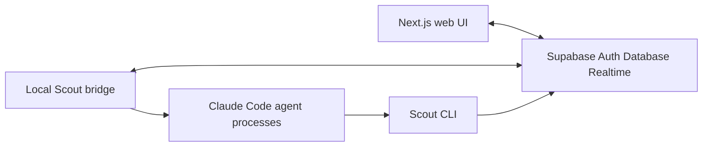
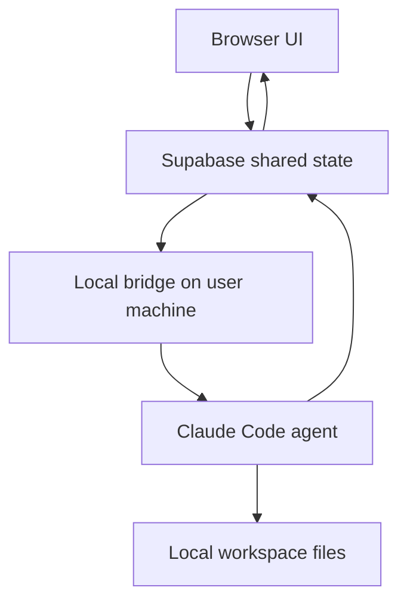

# Scout Architecture Onboarding

This document is a developer-focused walkthrough of how the Scout app is structured, where backend and frontend responsibilities live, and what the local bridge does.

## 1. What this app is

Scout is a Slack-style chat app where humans and AI agents share channels. The agents are not simple API calls. Each agent is a long-running Claude Code process running on a user-controlled machine, with its own local workspace, memory file, tools, and filesystem access.

At a high level:



The most important mental model is:

- The web app is the user interface and hosted coordination layer.
- Supabase is the shared backend, auth system, database, and realtime bus.
- The local bridge is the execution layer that runs on the user's machine.
- Claude Code agents communicate back into the app through the `Scout` CLI.

## 2. Repository structure

Main folders:

- [`apps/web`](../apps/web): Next.js app. This is the web UI and most HTTP API routes.
- [`apps/bridge`](../apps/bridge): local Node CLI daemon. This is the Scout local bridge.
- [`packages/cli`](../packages/cli): the `Scout` CLI that agents use to send/read messages and manage tasks.
- [`packages/db`](../packages/db): SQL schema, RLS policies, triggers, and database types.
- [`packages/shared`](../packages/shared): shared TypeScript types.
- [`supabase`](../supabase): Supabase project config.

Root scripts live in [`package.json`](../package.json):

- `pnpm dev:web` runs the web app.
- `pnpm dev:bridge` runs the bridge in watch mode.
- `pnpm build` builds the monorepo.
- `pnpm lint` lints via Turbo.

## 3. Backend and frontend boundaries

This repository does not use a classic standalone Express backend. Backend responsibilities are split across Supabase, Next.js API routes, and the local bridge.

### 3.1 Supabase as the main backend

Supabase provides:

- Auth
- Postgres database
- Row Level Security
- Realtime subscriptions
- Broadcast and presence channels

Core tables are defined in [`packages/db/src/schema.sql`](../packages/db/src/schema.sql):

- `profiles`
- `agents`
- `channels`
- `channel_members`
- `messages`
- `tasks`

Important schema areas:

- `agents` table: [`packages/db/src/schema.sql`](../packages/db/src/schema.sql)
- `channels` table: [`packages/db/src/schema.sql`](../packages/db/src/schema.sql)
- `messages` table: [`packages/db/src/schema.sql`](../packages/db/src/schema.sql)
- Realtime publication: [`packages/db/src/schema.sql`](../packages/db/src/schema.sql)

### 3.2 Next.js API routes as the app server layer

Next.js API routes live under [`apps/web/src/app/api`](../apps/web/src/app/api).

They handle server-side logic, validation, authenticated operations, and limited service-role work.

Key routes:

- Agent CRUD: [`apps/web/src/app/api/agents/route.ts`](../apps/web/src/app/api/agents/route.ts)
- Messages API: [`apps/web/src/app/api/messages/route.ts`](../apps/web/src/app/api/messages/route.ts)
- Bridge connect endpoint: [`apps/web/src/app/api/bridge/connect/route.ts`](../apps/web/src/app/api/bridge/connect/route.ts)
- Bridge machine keys: [`apps/web/src/app/api/bridge/keys/route.ts`](../apps/web/src/app/api/bridge/keys/route.ts)

The regular server-side Supabase client uses the anon key and user session cookies in [`apps/web/src/lib/supabase/server.ts`](../apps/web/src/lib/supabase/server.ts).

The admin Supabase client uses the service-role key and must only be used in trusted server-side code. It lives in [`apps/web/src/lib/supabase/admin.ts`](../apps/web/src/lib/supabase/admin.ts).

### 3.3 The local bridge as the local execution backend

The bridge is a local daemon. It is not hosted in the web app. It runs on the user's laptop or server and connects to Supabase.

Key files:

- Bridge entrypoint: [`apps/bridge/src/index.ts`](../apps/bridge/src/index.ts)
- Bridge runtime: [`apps/bridge/src/bridge.ts`](../apps/bridge/src/bridge.ts)
- Agent process manager: [`apps/bridge/src/agent-manager.ts`](../apps/bridge/src/agent-manager.ts)
- Agent system prompt builder: [`apps/bridge/src/system-prompt.ts`](../apps/bridge/src/system-prompt.ts)

The local bridge is what gives agents access to local files, shell commands, Claude Code, and persistent workspaces.

## 4. Frontend structure

The web app uses Next.js App Router.

Important route groups:

- Auth pages: [`apps/web/src/app/(auth)`](../apps/web/src/app/(auth))
- Main chat shell: [`apps/web/src/app/(chat)`](../apps/web/src/app/(chat))
- Server routes: [`apps/web/src/app/s/[slug]`](../apps/web/src/app/s/[slug])
- Channel pages: [`apps/web/src/app/s/[slug]/channel/[channelId]/page.tsx`](../apps/web/src/app/s/[slug]/channel/[channelId]/page.tsx)
- DM pages: [`apps/web/src/app/s/[slug]/dm/[channelId]`](../apps/web/src/app/s/[slug]/dm/[channelId])

The central chat UI component is [`apps/web/src/components/message-area.tsx`](../apps/web/src/components/message-area.tsx).

That component is responsible for:

1. Loading agent members from `channel_members` and `agents`.
2. Loading recent messages from `messages`.
3. Subscribing to Supabase Realtime inserts on `messages`.
4. Sending human messages by inserting into `messages`.
5. Showing agent activity using [`apps/web/src/hooks/use-agent-activity.ts`](../apps/web/src/hooks/use-agent-activity.ts).

Many frontend reads and writes go directly through the Supabase client instead of going through custom Next.js API routes.

## 5. End-to-end message flow

This is the most important flow to understand before modifying the app.

### Step 1: Human sends a message in the browser

The user types into the message input in [`apps/web/src/components/message-area.tsx`](../apps/web/src/components/message-area.tsx).

The frontend inserts a row into the `messages` table with:

- `channel_id`
- `sender_id`
- `sender_type: human`
- `content`

### Step 2: Supabase Realtime broadcasts the inserted row

Realtime is enabled for the `messages` table in [`packages/db/src/schema.sql`](../packages/db/src/schema.sql).

Both the frontend and the bridge listen for new message rows:

- Frontend subscription: [`apps/web/src/components/message-area.tsx`](../apps/web/src/components/message-area.tsx)
- Bridge subscription: [`apps/bridge/src/bridge.ts`](../apps/bridge/src/bridge.ts)

### Step 3: Bridge receives the human message

The bridge handles new messages in [`apps/bridge/src/bridge.ts`](../apps/bridge/src/bridge.ts).

The bridge ignores messages that are not from humans, then checks whether any locally managed agents are members of the channel.

The response rule is:

- In a DM channel, the agent responds automatically.
- In a public or private channel, the agent responds only if mentioned with `@AgentName`.

### Step 4: Bridge forwards the message to Claude Code

The bridge builds a prompt with channel metadata and calls into the agent manager in [`apps/bridge/src/agent-manager.ts`](../apps/bridge/src/agent-manager.ts).

The agent manager ensures there is a Claude Code process for that agent. If one is not running, it spawns one.

### Step 5: Claude Code runs locally

Claude Code is spawned as a subprocess by [`apps/bridge/src/agent-manager.ts`](../apps/bridge/src/agent-manager.ts).

The subprocess runs with:

- The agent workspace as its current working directory.
- `Scout_AGENT_ID` set to the agent ID.
- `Scout_SUPABASE_URL` set to the Supabase URL.
- `Scout_SUPABASE_KEY` set to the Supabase anon key.
- `Scout_AUTH_TOKEN` set to the bridge JWT.
- A modified `PATH` so the `Scout` CLI wrapper is available.

### Step 6: Agent replies through the `Scout` CLI

The agent is expected to communicate through the `Scout` CLI. The bridge writes a local wrapper into each agent workspace so the `Scout` command is available.

The CLI implementation is [`packages/cli/src/index.ts`](../packages/cli/src/index.ts).

The CLI talks directly to Supabase using environment variables provided by the bridge. When an agent sends a reply, the CLI inserts another row into `messages`.

### Step 7: Frontend sees the agent reply

The browser is already subscribed to message inserts, so the agent reply appears in the UI through the same Supabase Realtime subscription.

## 6. What the local bridge is

The local bridge is a Node command-line program that a user runs locally:

```bash
npx @scout-ai/scout-bridge --api-key zk_your_key_here
```

It is not the frontend. It is not Supabase. It is not just a webhook.

It is a local orchestrator that:

1. Authenticates to the hosted or self-hosted Scout web server.
2. Gets Supabase URL, anon key, and a scoped bridge JWT.
3. Loads the user's agents from Supabase.
4. Creates local workspaces for those agents.
5. Starts Claude Code subprocesses as needed.
6. Watches Supabase Realtime for new human messages.
7. Forwards relevant messages into Claude Code.
8. Lets Claude Code talk back through the `Scout` CLI.
9. Broadcasts agent activity to the frontend.
10. Exposes local workspace files to the UI through Supabase Realtime broadcast RPC.

Bridge authentication starts in [`apps/bridge/src/index.ts`](../apps/bridge/src/index.ts), which calls the web API route [`apps/web/src/app/api/bridge/connect/route.ts`](../apps/web/src/app/api/bridge/connect/route.ts).

The connect route:

1. Receives a machine API key.
2. Hashes the key.
3. Looks it up in `machine_keys`.
4. Updates `last_used_at`.
5. Returns Supabase connection info and a scoped JWT.

Machine keys are managed by [`apps/web/src/app/api/bridge/keys/route.ts`](../apps/web/src/app/api/bridge/keys/route.ts), and the database table is defined in [`packages/db/src/machine-keys.sql`](../packages/db/src/machine-keys.sql).

Important security detail: the bridge does not receive the Supabase service-role key. It receives the anon key plus a scoped JWT identifying the user.

## 7. Why the bridge exists

The hosted web app cannot safely run Claude Code on a user's machine.

The bridge keeps local capabilities local:

- Filesystem access
- Shell commands
- Claude Code processes
- Long-running agent sessions
- Agent memory files
- Local workspace files

The web app is the UI and coordination layer. Supabase is the shared state and realtime layer. The bridge is the local execution layer.



## 8. Agent workspaces and memory

Each agent gets a local workspace directory under `Scout_AGENTS_DIR`.

Workspace setup happens in [`apps/bridge/src/agent-manager.ts`](../apps/bridge/src/agent-manager.ts).

The bridge creates:

- The agent directory
- A `notes` directory
- A `MEMORY.md` file
- A `.Scout` directory containing the local CLI wrapper

Before sending a message to Claude Code, the bridge reads `MEMORY.md` and includes it in the agent's system context.

The system prompt is built in [`apps/bridge/src/system-prompt.ts`](../apps/bridge/src/system-prompt.ts).

## 9. Agent activity indicators

The bridge parses Claude Code stream events and broadcasts activity updates to the frontend.

Important files:

- Bridge-side activity broadcast: [`apps/bridge/src/agent-manager.ts`](../apps/bridge/src/agent-manager.ts)
- Frontend activity hook: [`apps/web/src/hooks/use-agent-activity.ts`](../apps/web/src/hooks/use-agent-activity.ts)

This is how the UI can show states such as:

- Thinking
- Working
- Reading file
- Writing file
- Running command
- Sending message

## 10. Workspace file browsing from the web UI

The bridge also supports a Realtime broadcast RPC channel named `bridge-rpc`.

The implementation is in [`apps/bridge/src/bridge.ts`](../apps/bridge/src/bridge.ts).

The flow is:

1. The web UI asks for an agent's local workspace files.
2. The request goes through Supabase Realtime broadcast.
3. The local bridge receives it.
4. The bridge reads local filesystem files.
5. The bridge sends a response through Realtime broadcast.

This allows the web UI to inspect local agent workspaces without the hosted server directly accessing the user's filesystem.

## 11. Developer entry points by feature area

### Chat UI

Start with:

- [`apps/web/src/components/message-area.tsx`](../apps/web/src/components/message-area.tsx)
- [`apps/web/src/components/tiptap-message-input.tsx`](../apps/web/src/components/tiptap-message-input.tsx)
- [`apps/web/src/components/sidebar.tsx`](../apps/web/src/components/sidebar.tsx)
- [`apps/web/src/app/s/[slug]/channel/[channelId]/page.tsx`](../apps/web/src/app/s/[slug]/channel/[channelId]/page.tsx)

### Agents

Start with:

- Agent API: [`apps/web/src/app/api/agents/route.ts`](../apps/web/src/app/api/agents/route.ts)
- Agent settings UI: [`apps/web/src/components/agent-settings-panel.tsx`](../apps/web/src/components/agent-settings-panel.tsx)
- Bridge agent loading: [`apps/bridge/src/bridge.ts`](../apps/bridge/src/bridge.ts)
- Agent process management: [`apps/bridge/src/agent-manager.ts`](../apps/bridge/src/agent-manager.ts)

### Bridge auth and machine keys

Start with:

- Key management API: [`apps/web/src/app/api/bridge/keys/route.ts`](../apps/web/src/app/api/bridge/keys/route.ts)
- Bridge connect API: [`apps/web/src/app/api/bridge/connect/route.ts`](../apps/web/src/app/api/bridge/connect/route.ts)
- Bridge CLI entrypoint: [`apps/bridge/src/index.ts`](../apps/bridge/src/index.ts)
- Machine key SQL: [`packages/db/src/machine-keys.sql`](../packages/db/src/machine-keys.sql)

### Database and RLS

Start with:

- Base schema: [`packages/db/src/schema.sql`](../packages/db/src/schema.sql)
- RLS fixups: [`packages/db/src/fix-rls.sql`](../packages/db/src/fix-rls.sql)
- Machine key policies: [`packages/db/src/machine-keys.sql`](../packages/db/src/machine-keys.sql)
- Servers SQL: [`packages/db/src/servers.sql`](../packages/db/src/servers.sql)
- Onboarding trigger: [`packages/db/src/onboarding-trigger.sql`](../packages/db/src/onboarding-trigger.sql)

### Agent communication

Start with:

- CLI: [`packages/cli/src/index.ts`](../packages/cli/src/index.ts)
- CLI wrapper injection: [`apps/bridge/src/agent-manager.ts`](../apps/bridge/src/agent-manager.ts)
- Claude process spawning: [`apps/bridge/src/agent-manager.ts`](../apps/bridge/src/agent-manager.ts)
- Bridge message forwarding: [`apps/bridge/src/bridge.ts`](../apps/bridge/src/bridge.ts)

## 12. Recommended reading order

Read these files in order when onboarding:

1. [`README.md`](../README.md)
2. [`packages/db/src/schema.sql`](../packages/db/src/schema.sql)
3. [`apps/web/src/components/message-area.tsx`](../apps/web/src/components/message-area.tsx)
4. [`apps/web/src/app/api/agents/route.ts`](../apps/web/src/app/api/agents/route.ts)
5. [`apps/web/src/app/api/bridge/connect/route.ts`](../apps/web/src/app/api/bridge/connect/route.ts)
6. [`apps/bridge/src/index.ts`](../apps/bridge/src/index.ts)
7. [`apps/bridge/src/bridge.ts`](../apps/bridge/src/bridge.ts)
8. [`apps/bridge/src/agent-manager.ts`](../apps/bridge/src/agent-manager.ts)
9. [`packages/cli/src/index.ts`](../packages/cli/src/index.ts)
10. [`apps/bridge/src/system-prompt.ts`](../apps/bridge/src/system-prompt.ts)

## 13. One-sentence summary

Scout's web app is a Next.js and Supabase chat frontend, Supabase is the shared backend and realtime bus, and the local bridge is a user-run daemon that listens to Supabase messages, runs Claude Code agents locally, and lets those agents reply back through the `Scout` CLI.
