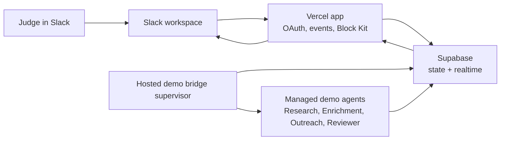

# Hackathon Launch Guide

Scout's public hackathon path is designed so judges can test multi-agent Slack coordination without installing the local bridge.

## Architecture



- Vercel hosts the web app, OAuth callbacks, Slack events, and interactive buttons/modals.
- Supabase stores workspace installs, channels, tasks, messages, and bridge keys.
- A persistent worker runs `pnpm start:hosted-demo-bridges` and starts one bridge process per connected Slack demo server.
- Judges only use Slack and the hosted `/demo` or `/slack` pages.

## Vercel Setup

Set these environment variables in Vercel:

```bash
NEXT_PUBLIC_APP_URL=https://your-vercel-app.vercel.app
NEXT_PUBLIC_SUPABASE_URL=...
NEXT_PUBLIC_SUPABASE_ANON_KEY=...
SUPABASE_SERVICE_ROLE_KEY=...
SLACK_CLIENT_ID=...
SLACK_CLIENT_SECRET=...
SLACK_SIGNING_SECRET=...
SCOUT_SLACK_TOKEN_ENCRYPTION_KEY=...
```

Slack app URLs should point at the Vercel app:

- OAuth redirect: `https://your-vercel-app.vercel.app/api/slack/oauth/callback`
- Events request URL: `https://your-vercel-app.vercel.app/api/slack/events`
- Interactivity request URL: `https://your-vercel-app.vercel.app/api/slack/agent-events`
- Slash command URL, if enabled: `https://your-vercel-app.vercel.app/api/slack/commands`

## Hosted Bridge Worker

Run the worker on Fly.io, Render, Railway, a VM, or any persistent container:

```bash
pnpm install
pnpm build
pnpm start:hosted-demo-bridges
```

Set the same Supabase and app URL variables on the worker:

```bash
NEXT_PUBLIC_APP_URL=https://your-vercel-app.vercel.app
NEXT_PUBLIC_SUPABASE_URL=...
SUPABASE_SERVICE_ROLE_KEY=...
SCOUT_SLACK_TOKEN_ENCRYPTION_KEY=...
```

The worker polls connected Slack workspaces, loads their Slack bridge machine keys, and starts bridge processes with isolated agent directories.

## Judge Flow

1. Open `https://your-vercel-app.vercel.app/demo`.
2. Click **Add to Slack**.
3. Sign in, connect Slack, and choose a channel such as `#scout-demo`.
4. Click **Set up hosted demo**.
5. In Slack, mention Scout with a task:

```text
@Scout Research Agnost and draft a short outreach note to Shubham about improving website messaging for YC S26 momentum.
```

Expected flow:

- Research Agent summarizes context.
- Enrichment Agent adds angles and constraints.
- Outreach Agent drafts one message.
- Slack shows Approve, Edit, and Reject buttons.
- Reject opens a modal and routes revision instructions back to Outreach Agent.

## Submission Checklist

- Submit the Vercel `/demo` URL as the project URL.
- Submit a prepared Slack developer sandbox URL as the primary hands-on test path.
- Invite `slackhack@salesforce.com` and `testing@devpost.com` to the sandbox.
- Keep the hosted demo bridge worker online during judging.
- Record the demo from the sandbox with the same seeded prompt for reliability.

## Demo Script

Use the first 90 seconds for the actual product:

1. Problem: Slack has bots, but not coordinated agent teams with human approval.
2. Mention Scout in Slack.
3. Show agent handoffs in the thread.
4. Show Outreach Agent's draft card.
5. Reject with "make it shorter".
6. Show the revised draft with fresh buttons.

Then spend 40 seconds on architecture and the final 30 seconds on impact.
