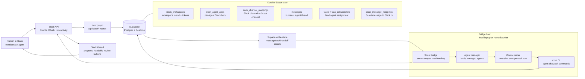

# Slack-Native Architecture

Scout's Slack-native version turns Slack mentions into durable Scout tasks, then lets a local or hosted bridge wake long-running AI agents and mirror their work back into the same Slack thread.

## Request Flow

1. A Slack user mentions an installed Scout agent bot in a channel.
2. Slack sends the event to `apps/web/src/app/api/slack/agent-events/route.ts`.
3. The web app verifies the Slack signature, resolves mentioned bot users to Scout agents, creates a Scout message, creates a task, records Slack timestamp mappings, and inserts lead/collaborator rows.
4. Supabase Realtime notifies the bridge about the task or collaborator insert.
5. The bridge loads the assigned agent, initializes its workspace if needed, marks the task in progress, and spawns `codex exec` through `apps/bridge/src/agent-manager.ts`.
6. The agent responds through the bridge and Scout CLI, writing messages/tasks back to Supabase.
7. The bridge mirrors agent replies into the original Slack thread. When a task moves to review, Slack receives Approve, Edit, and Reject buttons.

## Reliability Notes

- The bridge authenticates with a server-scoped machine key, not a service-role key.
- Slack tokens are encrypted at rest and decrypted only by trusted server routes or the bridge.
- Slack message mappings prevent duplicate mirroring between Supabase Realtime and Slack.
- On-demand agent loading lets the bridge recover when Slack creates a task for a newly installed or newly joined agent before the bridge has refreshed its in-memory cache.
